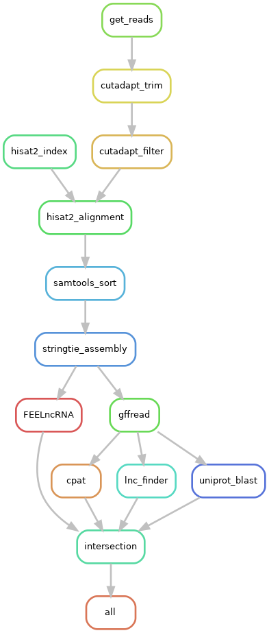

# 🧬 lncRNA-Workflow

**A modular and reproducible Snakemake pipeline for identification and analysis of lncRNAs from RNA-seq data.**

This pipeline is designed to start directly from **SRA accession IDs** and automate the full process of identifying both known and novel **long non-coding RNAs (lncRNAs)** using a set of standard and powerful tools. It’s ideal for beginners who want a reproducible way to analyze RNA-seq data with minimal setup.

---

## 🧾 Table of Contents

- [Overview](#overview)
- [Workflow Summary](#workflow-summary)
- [Requirements](#requirements)
- [Installation](#installation)
- [How to Use](#how-to-use)
- [Output](#output)
- [Visualization](#visualization)
- [Credits](#credits)

---

## 📖 Overview

lncRNAs (long non-coding RNAs) are transcripts longer than 200 nucleotides that do not encode proteins but are involved in regulating gene expression, chromatin organization, and other cellular processes. 

This workflow provides a comprehensive method to:
- Download RNA-seq data from NCBI SRA
- Preprocess and align reads
- Assemble transcripts
- Apply multiple coding potential filters
- Identify high-confidence lncRNAs

---

## 🔁 Workflow Summary

The figure below shows the structure of the pipeline:



### Key Steps:

1. **get_reads** – Automatically downloads RNA-seq datasets using SRA IDs (via `fastq-dump` or `prefetch`).
2. **cutadapt_trim & cutadapt_filter** – Removes adapter sequences and filters low-quality reads.
3. **hisat2_index** – Builds genome index from the reference genome.
4. **hisat2_alignment** – Aligns reads to the reference genome.
5. **samtools_sort** – Sorts aligned reads for assembly.
6. **stringtie_assembly** – Assembles transcripts from the aligned reads.
7. **gffread** – Processes the GTF file for compatibility.
8. **FEELncRNA, CPAT, lnc_finder** – Apply multiple tools to identify lncRNAs based on coding potential.
9. **uniprot_blast** – Removes known protein-coding transcripts.
10. **intersection** – Combines filtered results from all tools to identify high-confidence lncRNAs.
11. **all** – Final results.

---

## 💻 Requirements

- **Snakemake ≥ 7.0**
- **Python ≥ 3.6**
- **Conda** (recommended)

### Required Tools (installed automatically via Conda environments):
- `sra-tools` (for `fastq-dump`)
- `cutadapt`
- `hisat2`
- `samtools`
- `stringtie`
- `gffread`
- `CPAT`
- `FEELnc`
- `BLAST+`

---

## ⚙️ Installation

Clone the repository:

```bash
git clone https://github.com/bigfacilityiisr/lncRNA-Workflow.git
cd lncRNA-Workflow
```

## 🚀 How to Use

1. Edit the config.yaml file

Provide:
A list of SRA accession IDs under samples
Path to the reference genome and annotation file
Optional: Change paths and parameters if needed

Example:

samples:
  - SRR12345678
  - SRR87654321
genome: "data/genome.fa"
annotation: "data/annotation.gtf"

2. Run the Pipeline
'''bash
snakemake --cores 4 --use-conda
'''
This will:

-Download SRA datasets

-Preprocess and align reads

-Assemble transcripts

-Predict and filter lncRNAs

-Output a final list of confident lncRNA transcripts

## 📦 Output
You’ll get the following:

✅ Assembled transcripts (.gtf)

✅ Output from FEELnc, CPAT, lncFinder

✅ BLAST results against UniProt

✅ Filtered intersection of predictions

✅ Final set of high-confidence lncRNAs

✅ Log files for each rule

## 📊 Visualization
To visualize the entire workflow as a DAG (Directed Acyclic Graph):

snakemake --dag | dot -Tpng > rulegraph.png
This will generate a graphical representation of how the steps depend on each other.

## 🙏 Credits
This pipeline was developed as part of a Ginger lncRNA discovery project. It integrates tools like FEELnc, CPAT, and BLAST+ using Snakemake to ensure reproducibility, modularity, and scalability.
